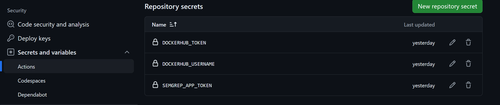
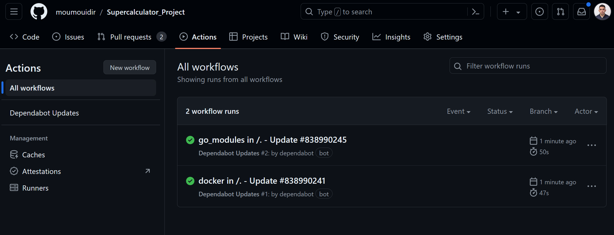
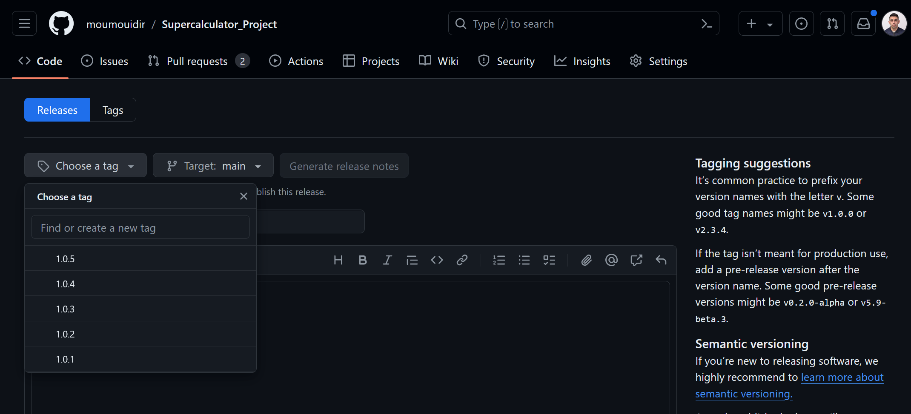
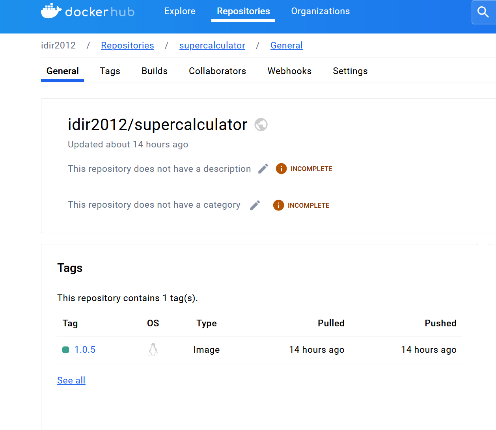
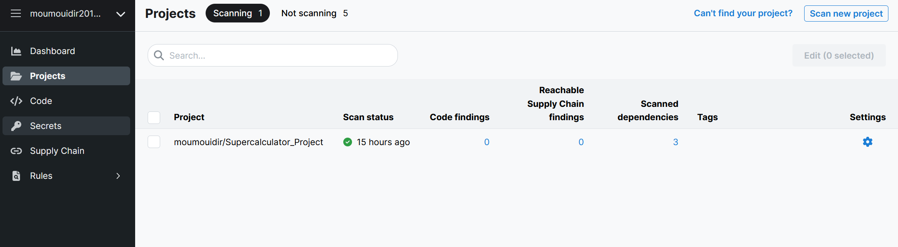
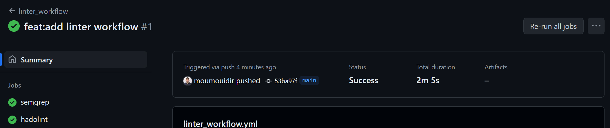
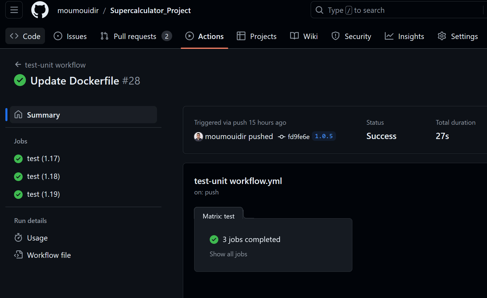
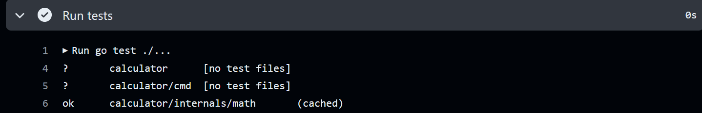

# Supercalculateur

## 1- Workflow Dependabot :

Dependabot est un outil qui aide à garder les dépendances de notre projet à jour automatiquement.

On va crée un fichier dependabot.yaml dans notre Project :

---

```yaml
---
version: 2
updates:
  - package-ecosystem: "docker"
    directory: "/"
    schedule:
      interval: "daily"
  - package-ecosystem: "gomod"
    directory: "/"
    schedule:
      interval: "daily"
```

**Explication du fichier:**

- `version: 2`: Spécifie la version du format de configuration de Dependabot.
- `updates`: Contient une liste de configurations  de paquets que vous souhaitez mettre à jour.
- `package-ecosystem`: Spécifie l'écosystème de paquets  "docker" et "gomod" pour les modules Go.
- `directory`: Le répertoire dans lequel Dependabot cherchera les fichiers de configuration des dépendances.
- `schedule`: La fréquence à laquelle Dependabot doit vérifier les mises à jour.
    - `interval`:  "daily",

**Résultat :**



## 2.Release workflow :

ce workflow aura  pour but de automatiser   la création image du Project

mise en place workflow qui se  déclenche lors de la création d ‘ un tags

voici mon fichier 

---

```yaml
---
name : Release workflow
on:
  push:
    tags:
    - '*.*.*'
permissions:
  contents: write
  pull-requests: write
  statuses: write
jobs:
  build-release:
    runs-on: ubuntu-latest

    steps:
      - uses: actions/checkout@v4
      - name: Set up Go
        uses: actions/setup-go@v5

      - name: Run GoReleaser
        uses: goreleaser/goreleaser-action@v6
        with:
          version: 1.21
          args: release --clean
        env:
          GITHUB_TOKEN: ${{ secrets.GITHUB_TOKEN}}

  build_and_push_img:
      runs-on: ubuntu-latest
      steps:
        - uses: actions/checkout@v4
        - uses: docker/login-action@v3
          with:
            username: "${{secrets.DOCKERHUB_USERNAME}}"
            password: "${{secrets.DOCKERHUB_TOKEN}}"
        - uses: docker/build-push-action@v5
          with:
            push: true
            tags: "${{secrets.DOCKERHUB_USERNAME}}/supercalculator:${{ github.ref_name }}"
```

**Remarque :**

- il faut d’abord crée ses secrètes variables (DOCKERHUB_USERNAME,DOCKERHUB_TOKEN) comme suite dans note GitHub dans le Setting /sécurité /actions /new repository secret :



- Pour le déclenche il faut crée une Release avec Tag  aller dans le voles Release/create new Release et on choisis notre la forme Tag  comme suite :



**Explication  du fichier :**

1. **`on`** : Déclenche le workflow lors du push d'un tag correspondant au motif `.*.*` 
2. **`permissions`** : Définir les autorisations néces
3. **`jobs`** : Définit deux tâches principales :
    - **`release`** : Configure l'environnement Go et exécute GoReleaser.
    - **`build_and_push_img`** : Se connecte à Docker Hub, construit et pousse l'image Docker.
4. **`steps`** : Chaque tâche contient une série d'étapes :
    - **`actions/checkout@v4`** : il cherche mon  code
    - **`actions/setup-go@v5`** : Installe Go.
    - **`goreleaser/goreleaser-action@v6`** : Exécute GoReleaser.
    - **`docker/login-action@v3`** : Se connecte à Docker Hub.
    - **`docker/build-push-action@v5`** : Construit et pousse l'image Docker.
    - **`${{ secrets.GITHUB_TOKEN }}**` : Une variable d'environnement qui contient le jeton GitHub pour l'authentification.
    - **`${{ secrets.DOCKERHUB_USERNAME }}**` et **`${{ secrets.DOCKERHUB_TOKEN }}`** : Secrets stockés dans le dépôt GitHub contenant respectivement le nom d'utilisateur et le jeton pour Docker Hub.

**Résultat:**



## 3-Lint workflow :

ce workflow a pour but de  vérifier la qualité du code et les éventuelles erreurs de style sur notre  codebase chaque fois qu'il y a une pull request ou un push vers la branche `main`, ou lorsque le workflow est déclenché manuellement:

---

```yaml

---
name: linter workflow
on:
  pull_request:
  push:
    branches:
      - main
  workflow_dispatch:
permissions:
  contents: write
  pull-requests: write
  statuses: write
jobs:
  semgrep:
    runs-on: ubuntu-latest
    container:
      image: returntocorp/semgrep:1.75.0
    if: ( github.actor != 'dependabot[bot]')
    steps:
      - uses: actions/checkout@v4
      - run: semgrep ci
        env:
          # Connect to Semgrep AppSec Platform through your SEMGREP_APP_TOKEN.
          # Generate a token from Semgrep AppSec Platform > Settings
          # and add it to your GitHub secrets.
          SEMGREP_APP_TOKEN: ${{ secrets.SEMGREP_APP_TOKEN }}
  hadolint:
    runs-on: ubuntu-latest
    steps:
      - uses: actions/checkout@v4
      - uses: hadolint/hadolint-action@v3.1.0
        with:
          dockerfile: Dockerfile
  super-linter:
    runs-on: ubuntu-latest
    if: github.event_name == 'pull_request'
    steps:
      - uses: actions/checkout@v4
        with:
          # super-linter needs the full git history to get the
          # list of files that changed across commits
          fetch-depth: 0
      - uses: super-linter/super-linter@v6.6.0
        env:
          VALIDATE_ALL_CODEBASE: true
          GITHUB_TOKEN: ${{secrets.GITHUB_TOKEN}}
```

**Explication du fichier :**

- **on**: Spécifie les événements qui déclenchent ce workflow.
    - **pull_request**:  lorsqu'une pull request est créée
    - **push**: lorsqu'un push est effectué sur la branche `main`.
    - **workflow_dispatch**: Permet de déclencher le workflow manuellement depuis l'interface GitHub Actions.
- **permissions**: Définie les permissions nécessaires pour ce workflow, permettant d'écrire des contenus, des pull requests et des statuts.

### **A-Job** `semgrep`**:**

Semgrep est un outil d'analyse statique de code. Il permet de rechercher des motifs dans le code source, codifiés dans des règles avec une syntaxe simple et intuitive. Il peut être utilisé pour identifier des vulnérabilités de sécurité, des anti-patterns, des bugs, des erreurs de configuration, des problèmes de performance

- **container**: Utilise l'image Docker `returntocorp/semgrep:1.75.0` pour exécuter les commandes.
- **if**: Condition pour exécuter ce job seulement si l'acteur GitHub n'est pas `dependabot[bot]`.
- **steps**:
    - **actions/checkout@v4**: Action pour vérifier le code source du dépôt.
    - **run: semgrep ci**: Exécute Semgrep en mode CI.
    - **env**: Définit des variables d'environnement, notamment `SEMGREP_APP_TOKEN`, pour authentifier la connexion à la plateforme Semgrep AppSec
        
        voici le résultat sur la plateforme :
        
    
   


**Note :**  il faut crée une  secret  variable nomme `SEMGREP_APP_TOKEN` et récupéré le token depuis la plateforme semgrep 

### B-Job `hadolint` :

  *est* un outil de linting pour les Dockerfile nous  aide à vérifier que nos Dockerfiles respectent les meilleures pratiques

- **runs-on**: Spécifie l'environnement sur lequel le job s'exécute, ici `ubuntu-latest`.
- **steps**:
    - **actions/checkout@v4**: Action pour vérifier le code source du dépôt.
    - **hadolint/hadolint-action@v3.1.0**:  exécuter Hadolint
        - **with**: Spécifie le Dockerfile

**note :**

Apres avoir passer le Hadolint sur notre dockerfile on se rend compte il y a des erreurs dans Dockerfile,  Hadolint nous signale ces deux erreurs suivante :  


donc on apporter une correction sur dockerfile  comme suit :

```docker
FROM golang:1.19-buster AS build

WORKDIR /app

COPY go.mod ./
COPY go.sum ./
RUN go mod download

COPY . .

RUN go build -o /calculator

FROM gcr.io/distroless/base-debian12:nonroot

WORKDIR /

COPY --from=build /calculator /calculator

USER nonroot:nonroot

ENTRYPOINT ["/calculator"]
```

### C-Job `super-linter`

Le Super Linter est une GitHub Action qui permet d'automatiser le linting , c'est-à-dire la recherche d'erreurs dans le code, dans tout référentiel GitHub. Cette fonction supporte une vingtaine de langages de programmation :

- **if**: Condition pour exécuter ce job seulement si l'événement GitHub est un  pull request.
- **steps**:
    - **actions/checkout@v4**: Action pour vérifier le code source du dépôt.
        - **with**: Spécifie `fetch-depth: 0` pour récupérer l'historique complet du dépôt, nécessaire pour Super-Linter.
    - **super-linter/super-linter@v6.6.0**:  exécuter Super-Linter
        - **env**:
            - **VALIDATE_ALL_CODEBASE**: Détermine si tout le code doit être validé (ici, c'est `true`).
            - **GITHUB_TOKEN**: Token secret pour authentifier les actions GitHub

### Résultat :



## 4.Test workflow :

Ce workflow a pour but   exécuter des tests unitaires pour notre projet Go sur différentes versions de Go lorsque vous poussez des modifications vers le dépôt:

---

```yaml
---
name: test-unit workflow
on:
  push:
jobs:
  test:
    runs-on: ubuntu-latest
    strategy:
      matrix:
        go-version: ['1.17', '1.18', '1.19']
    steps:
      - uses: actions/checkout@v4
      - uses: actions/setup-go@v4
        with:
          go-version: ${{ matrix.go-version }}

      - name: Install dependencies
        run: go mod download

      - name: Run tests
        run: go test ./...
```

**Explication du ficher :**

- **runs-on**: Spécifie l'environnement sur lequel le job s'exécute, ici `ubuntu-latest`.
- **strategy** : on définir une stratégie de matrix permettant de tester le code sur plusieurs versions de Go.
    - **matrix**: Définit les différentes versions de Go
- **steps** :
    - actions/checkout@v4 : chercher le code du Project
    - actions/setup-go@v4: installer go
        
        **With:**
        **go-version:** Spécifie la version de Go à utiliser, qui est déterminée par la stratégie de matrix.
        
    - **run:** go mod download : c'est pour installer  les dépendances de go
    - **run:** go test ./..  :  c'est pour exécuter les tests unitaire

**Résultat :**





**Bonus :**
